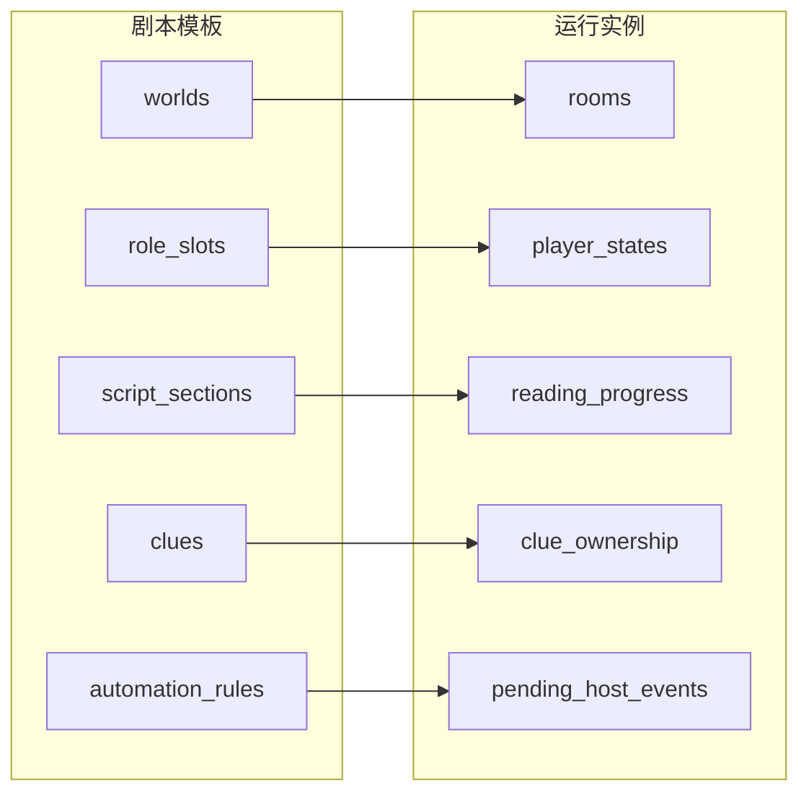

# 织幕 · 系统设计说明

> **文档用途**：解释产品架构、领域边界、三端分工与主持—玩家运行闭环。面向新成员、协作创作者与运维。  
> **更新**：2026-06-18 · 后端 **341** 项测试 · 路由 schema **61** 条  
> **姊妹文档**：[ARCHITECTURE.md](../ARCHITECTURE.md)（数据边界精要）· [PLATFORM_MAP_ZH.md](./PLATFORM_MAP_ZH.md)（API↔UI 对照）· [FEATURE_CATALOG.md](../FEATURE_CATALOG.md)（功能总表）

---

## 1. 系统是什么

**织幕**是面向**线上长线剧本杀 / 跑团**的自动化叙事引擎：

- **创作者**在云端编写世界、编排场景与线索、配置自动化规则；
- **主持人**开平行运行房、监控进度、确认关键节点、手动干预；
- **玩家**通过邀请码选角，阅读私人分幕、探索场景、收集线索与物品；
- 所有运行态写入 **PostgreSQL**；附件在 **Cloudflare R2**；房间事件经 **SSE** 实时推送。

设计核心：**剧本模板**与**房间运行实例**严格分离——同一母本可开多个平行房，任一房的进度、线索与结局不污染模板或其他房间。

---

## 2. 三端一 API

```text
                    ┌─────────────────────────────────────┐
                    │     Fastify API (PostgreSQL)        │
                    │  /api/*  ·  SSE  ·  Session/OAuth   │
                    └───────────┬─────────────────────────┘
          ┌─────────────────────┼─────────────────────┐
          │                     │                     │
   getzhimu.com          app.getzhimu.com      play.getzhimu.com
   (site/ 营销)         (主应用 Vite)          (玩家端 Vite)
                        创作·编排·规则          入房·阅读·探索
                        主持台·玩家预览          广场·好友·私信
                        存档复盘·资产            局内复盘 Tab
```

| 端 | 目录 | 典型用户 | 不做的事 |
|----|------|----------|----------|
| **主应用** | 仓库根 `src/` + `app.js` | 作者、主持、协编 | 不承载营销落地页 |
| **玩家端** | `play/` | 入房玩家 | 无创作台、无主持工具 |
| **官网** | `site/` | 访客 | 无运行态 API 调用 |
| **后端** | `backend/src/` | — | 单一真相源；三端共用 |

本地默认：`4173` 主应用 · `5174` 玩家端 · `4180` API。详见 [FRONTEND_README_ZH.md](./FRONTEND_README_ZH.md)、[play/README.md](../play/README.md)。

---

## 3. 领域模型：模板 vs 实例

### 3.1 剧本模板（World Template）

作者反复编辑、版本化、可导入导出：

| 实体 | 含义 |
|------|------|
| `worlds` | 剧本世界（名称、简介、协作成员） |
| `chapters` | 章节（公共叙事结构） |
| `role_slots` | 角色席位（玩家可选角） |
| `character_scripts` / `script_sections` | 角色私人分幕（阅读单元） |
| `scenes` | 公共/开放场景（探索文本） |
| `clues` / `items` | 线索与物品定义 |
| `investigation_points` | 调查点（挂场景） |
| `automation_rules` | 结构化 JSON 规则（非用户 JS） |
| `story_edges` / 编排布局 | 剧情图谱 |

### 3.2 房间运行实例（Room Runtime）

每次开团独立持久化：

| 实体 | 含义 |
|------|------|
| `rooms` | 平行运行房（邀请码、公开 listing） |
| `room_members` | 谁以什么 `role_slot_id` 入房 |
| `player_states` | 角色运行时变量、当前场景 |
| `reading_progress` | 分幕完成记录 |
| `notebook_entries` | 玩家笔记与高亮 |
| `clue_ownership` | 线索归属、私享、已读 |
| `inventory` | 背包数量 |
| `room_content_unlocks` | 已解锁分幕/场景 |
| `rule_executions` | 规则幂等执行记录 |
| `pending_host_events` | 待主持确认事件 |
| `timeline_logs` | 房间时间线（含玩家/主持动作） |
| `checkpoints` / `recaps` | 存档快照与复盘报告 |
| `voice_rooms` | 语音房与 LiveKit 授权 |



---

## 4. 内容结构（玩家可见什么）

权限由后端推导，**不依赖前端隐藏**：

1. **入房** — `POST /rooms/join` 绑定 `room_members.role_slot_id`。
2. **player-home** — 只返回该角色已解锁的 `sections`、持有线索、背包、语音房列表。
3. **阅读** — 玩家 `complete section` → 写入 `reading_progress` → 触发规则评估。
4. **探索** — 已开放 `scenes` + 可调查点；调查完成写时间线并可能触发规则。
5. **线索** — `clue_ownership` 决定可见性；支持房间公开、指定角色私享。

私密分幕内容**永不**通过公共 API 泄露给其他角色。

---

## 5. 规则引擎

规则 = **条件 JSON** + **动作 JSON** + **模式**：

| 模式 | 行为 |
|------|------|
| `automatic` | 条件满足即执行动作 |
| `host_confirm` | 生成 `pending_host_events`，等主持 execute/dismiss |
| `manual` | 主持在监控台预览后手动 trigger |

常见条件：阅读完成、持有线索/物品、调查完成、`variable_compare`（player_states）。  
常见动作：解锁分幕/场景、发放线索/物品、写时间线。  
执行结果写入 `rule_executions`，保证**幂等**。

实现：`backend/src/rule-engine.js`。测试：`rule-engine.test.js`、`rule-runtime.test.js`。

---

## 6. 主持—玩家运行闭环（2026-06 重点）

这是产品「能跑一局」的关键链路：

```text
玩家完成阅读/调查
    → 规则评估（自动 or host_confirm）
    → [若 host_confirm] pending_host_events
    → 主持台 director：待办列表 + 关联玩家芯片 + 实时动态
    → 主持 execute / dismiss
    → SSE room.host_event_* / section_unlocked / scene_unlocked
    → 玩家端（app player + play game）横幅 + toast + 局部刷新
    → 可选：主持 POST host/nudge-waiting → SSE room.host_nudge
    → 局后：主持生成 recap → 玩家 archive / play 复盘 Tab
```

### 6.1 后端

| API / 事件 | 说明 |
|------------|------|
| `GET .../player-home` | 含 `hostConfirm: { pendingCount, waitingForYou, titles }` |
| `GET/POST .../host-events` | 待确认列表、批量 execute/dismiss、delay |
| `POST .../host/nudge-waiting` | 向指定角色 SSE 提醒（写 timeline + `room.host_nudge`） |
| `GET/POST .../recaps` | 全局/玩家视角复盘 |
| SSE `room.host_event_pending` 等 | 见 `room-events-routes.js` |

辅助：`host-helpers.js`（`extractTriggerPlayers`、`fetchPlayerHostConfirmStatus`）。

### 6.2 主应用（app.getzhimu.com）

| 视图 | 能力 |
|------|------|
| `director` | 玩家表、待办、关联玩家、**提醒等待中的玩家**、审计、线索矩阵、规则预览 |
| `player` | 等待主持横幅、**复盘入口**（模态玩家视角） |
| `archive` | checkpoint、recap 生成与恢复 |
| `runtime/room-events.js` | SSE 分发与 toast |

### 6.3 玩家端（play.getzhimu.com）

| 模块 | 能力 |
|------|------|
| `views/game.js` | 分幕/探索/线索/背包/**复盘 Tab** |
| `runtime/patch-game.js` | SSE 触发**局部 DOM 更新**（tab/侧栏/横幅，保留滚动与输入焦点） |
| `runtime/url.js` | `?view=` `?tab=` `?join=` `?reset=` `?verify=` 深链 |
| `views/auth.js` | 注册/登录/找回密码/邮箱验证 |

共享视觉：`shared/tokens.css`。

---

## 7. 实时层（SSE）

- 端点：`GET /api/rooms/:roomId/events/stream`（支持 `Last-Event-ID` 重连）。
- 持久化：`room_event_journal` 为真相源；多实例时 `ROOM_EVENTS_BUS=postgres` + NOTIFY 扇出。
- 客户端：主应用 `src/runtime/room-events.js`；玩家端 `play/src/room-events.js`。
- 生产限流：**SSE 不计入** write/read 桶（见 `rate-limit.js`）。

主要事件类型：`section_completed`、`host_event_pending`、`host_event_resolved`、`host_nudge`、`clue_granted`、`scene_unlocked`、`voice_message_created` 等。

---

## 8. 身份与权限

- **Session**：Bearer token → `request.actorId`；游客可升级注册。
- **世界协作**：owner / editor / host / viewer（`world_members`）。
- **房间内**：host / cohost / player（`room_members` + 主持 API 守卫）。
- **能力门槛**：`capabilities.js`（如发帖需验证邮箱、`platform.social.write`）。
- **演示头**：`x-user-id` 仅本地 `ALLOW_DEMO_USER_HEADER=true`；生产强制关闭。

详 [IDENTITY_AND_PERMISSIONS.md](./IDENTITY_AND_PERMISSIONS.md)。

---

## 9. 数据可信原则（P0）

总览、资产、存档等视图**只展示 API 数据或空状态**——禁止硬编码假玩家、假日志、假资产。  
主持与创作者必须能信任界面上的运行态。见 [FEATURE_CATALOG.md §12](../FEATURE_CATALOG.md#12-近期变更p0-1--2026-06-03)。

---

## 10. 工程与验证

| 命令 | 用途 |
|------|------|
| `npm run verify:changed` | 按 git diff 最小检测（日常提交） |
| `npm run verify:full:fresh` | 迁移 + seed + 全量测试 + smoke + E2E |
| `cd backend && npm test` | **341** 项单元/集成 |
| `npm run test:e2e` | Playwright **7** 项（主持 nudge + play 入房） |
| `node scripts/ui-smoke.js` | **44** 项前端接线 |

测试桩房间：`TEST-FIXTURE-DEMO`（勿与 E2E 写入房混淆）。见 [WORLDS_AND_FIXTURES_ZH.md](./WORLDS_AND_FIXTURES_ZH.md)。

测试环境默认 `REGISTER_IP_DAY_MAX=0`（`test/hooks.mjs`），避免全量注册用例互相触发 IP 上限；生产默认仍为 **5**/24h。

---

## 11. 文档索引

| 文档 | 何时读 |
|------|--------|
| **本文** | 理解架构与运行闭环 |
| [PLATFORM_MAP_ZH.md](./PLATFORM_MAP_ZH.md) | 查 API ↔ 前端入口 |
| [FEATURE_CATALOG.md](../FEATURE_CATALOG.md) | 查某功能是否已实现 |
| [ARCHITECTURE.md](../ARCHITECTURE.md) | 数据表边界与权限原则 |
| [PRODUCT_STATUS_ZH.md](./PRODUCT_STATUS_ZH.md) | 产品完成度与风险 |
| [SECURITY_AND_TESTING.md](../SECURITY_AND_TESTING.md) | 安全与测试矩阵 |
| [CREATOR_GUIDE.md](./CREATOR_GUIDE.md) | 创作者首次体验 |

---

## 12. 演进方向（非阻塞）

- Play 端 header/全局壳层 SSE 局部更新（当前已 patch tab/侧栏/横幅）
- 社交：嵌套回复、好友分页、站外通知
- 规则可视化积木（当前 JSON + 可视化编辑器并存）
- LiveKit 生产环境全链路验收
- 全文检索、实体卡、上传扫描规模化

路线图：[ROADMAP_LAUNCH_ZH.md](./ROADMAP_LAUNCH_ZH.md)。
