# 织幕产品体验与视觉审计（2026-07-30）

审计日期：2026-07-30
模式：UX + 视觉 + 可访问性风险合并审计
范围：官网首屏与产品展示、移动端导航、Creator 首次入口与降级状态、Player 首次入口、Host 选房入口、早期创意提案
证据环境：本地前端；Creator / Player / Host 未连接本地 API，因此错误和降级状态是本轮重点证据，不代表生产服务当前不可用

## 1. 总体结论

织幕已经建立了有辨识度的视觉语言：米白纸张、墨绿、铜金、中文衬线标题和真实产品截图，整体比常见“AI 工具蓝紫渐变”更成熟，也更贴近剧本、编辑和叙事主题。

当前主要问题不是美术质量，而是信息层级与状态设计：

1. 官网视觉和核心表达已经成立，但移动端菜单漏掉最关键的登录 / 创作转化入口。
2. Creator 的降级状态连续出现多条同义提示，遮蔽了主任务。
3. Host 直接显示 `[object Object] (502)`，是当前最明显的前端产品化缺口。
4. Player 的入口最清楚，可作为其他端“角色明确、任务单一、下一步直达”的参照。
5. 早期创意提案与当前品牌视觉和工程事实明显脱节。

## 2. 审计步骤

### Step 1 · 官网桌面首屏 — 良好

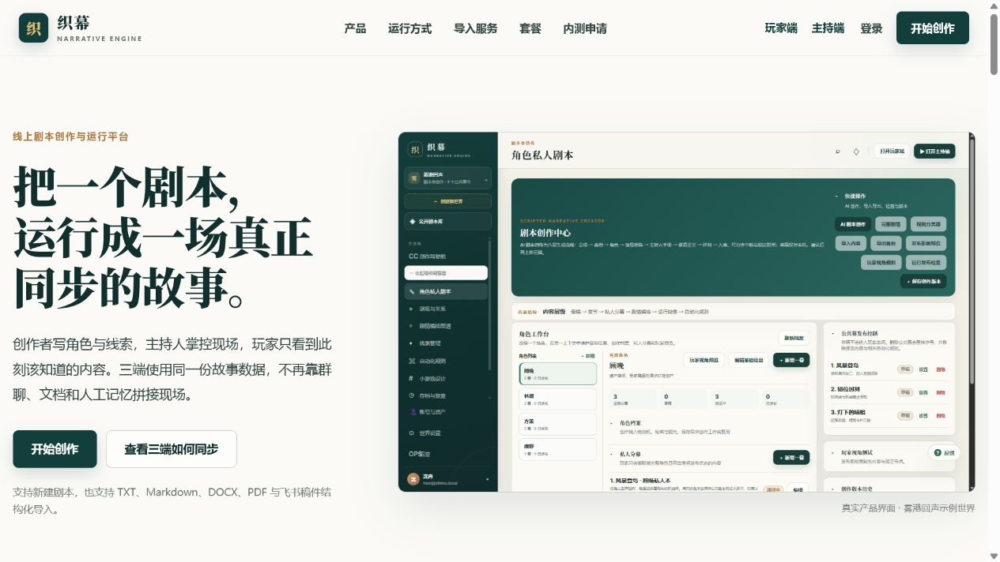

**优点**

- “把一个剧本，运行成一场真正同步的故事”比早期“互动叙事引擎”更像用户价值。
- 文字与真实产品截图形成清楚的 40/60 证据结构。
- 主 CTA、次 CTA、导入格式说明层级明确。
- 颜色、字体和留白构成稳定的品牌记忆。

**风险**

- 首屏同时面向创作者、主持、玩家，购买者优先级仍不够明确。
- “开始创作”对已有母稿的工作室不如“导入剧本并跑首场测试”具体。
- 产品截图信息密度高，小尺寸下难读；应通过局部放大或标注解释关键价值。

**可访问性风险**

- 仅凭截图无法确认正文、铜金小字和边框的实际对比度是否达到目标。
- 需要继续验证键盘焦点、缩放 200% 和动效减弱设置。

### Step 2 · 官网三端产品展示 — 良好

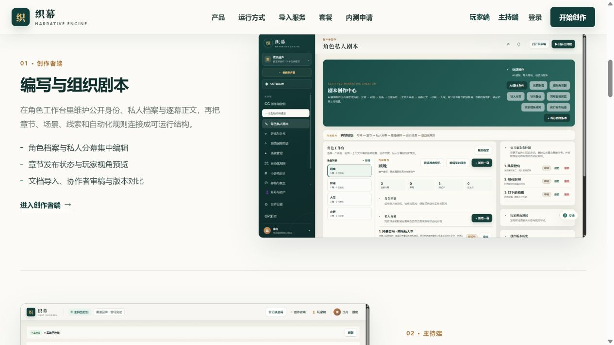

**优点**

- 创作者、主持、玩家按真实界面解释，不再使用同一占位图。
- 交替构图有节奏，符合长页面阅读。
- 每一端都有明确职责和入口。

**风险**

- 文字仍在列举能力，缺少一个贯穿三端的“同一事件如何变化”的证据。
- 可新增三端同屏示例：作者发布一幕 → 主持解锁 → 玩家收到内容。
- 大图右侧/左侧交替时，用户容易把它看成三个独立产品，而非同一状态的三种视角。

### Step 3 · 官网主持与玩家区衔接 — 良好

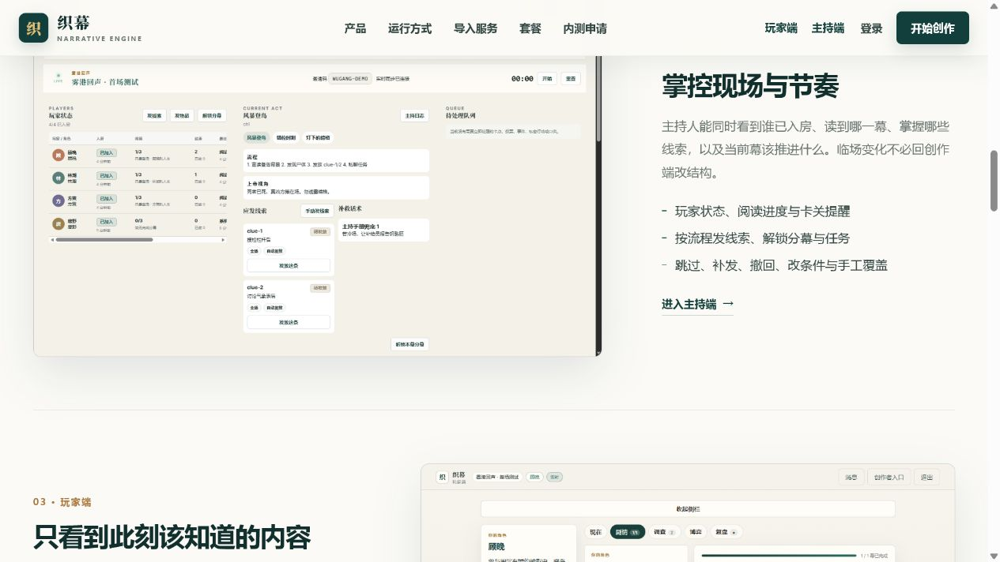

**优点**

- 主持端“掌控现场与节奏”、玩家端“只看到此刻该知道的内容”角色差异清楚。
- 主持截图能够证明实时进度、线索和操作不是概念。

**风险**

- 玩家段落在首屏下沿被截断，长页面依赖继续滚动；可用章节标记或三端总览加强方向感。
- 主持卖点应从“功能很多”收束为“系统同步常规状态，主持只处理关键节点”。

### Step 4 · 官网移动端首屏 — 良好

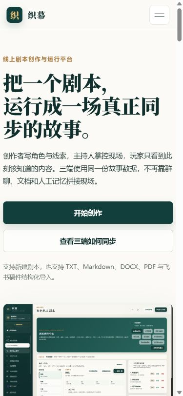

**优点**

- 标题、解释、CTA、截图顺序正确。
- 两个 CTA 使用整行按钮，点击目标清晰。
- 桌面视觉语言在移动端保持一致。

**风险**

- 标题在 390px 下占四行，首屏高度较重；可评估更短的移动端标题或略收字号。
- 主次按钮高度和宽度完全相同，差异主要靠填充色，仍可接受但需要焦点态验证。
- 产品截图在移动端只能证明“有产品”，无法读出价值；可换为裁切过的重点局部。

### Step 5 · 官网移动端菜单 — 需改进

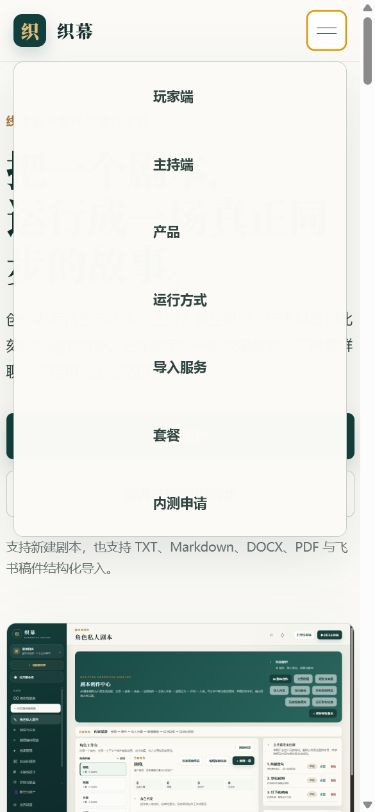

**问题**

- 菜单包含玩家端、主持端、产品、运行方式、导入、套餐和内测申请，但没有“登录”和“开始创作”。
- 菜单占据几乎整个可视区，用户打开后只能先做信息导航，不能完成主要转化。
- 入口平铺且权重相同，没有区分产品内容、角色入口和账号动作。

**建议**

- 菜单分为“了解产品”“进入角色端”两组。
- 底部固定“登录”和一个全宽主 CTA。
- 打开菜单后把按钮可访问名称改成“关闭导航”，并验证 Esc、焦点圈和焦点回到触发按钮。

### Step 6 · Creator 注册 / 登录入口 — 一般

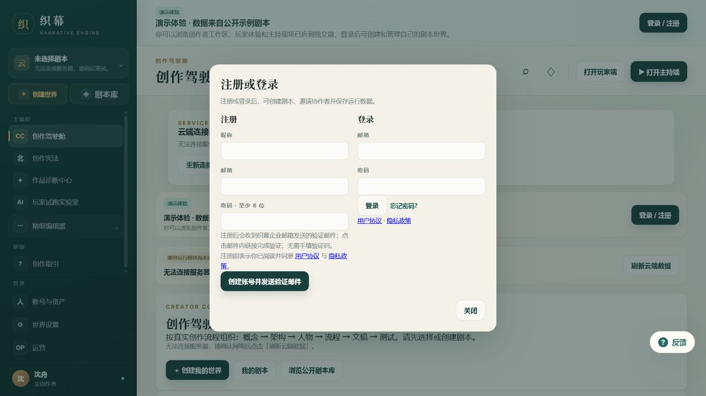

**优点**

- 注册和登录可以在同一层完成，减少页面跳转。
- 背景仍能让用户感知这是完整创作产品，而非独立账号站。
- 表单字段、隐私与用户协议入口完整。

**问题**

- 两栏表单使首次用户同时做“选注册还是登录”和“理解产品背景”两次判断。
- “创建账号并发送验证邮件”按钮过长，视觉重量偏大。
- 背景已有登录 / 注册按钮和多条状态提示，模态再重复一次，视觉噪声高。
- 注册密码只有“至少 8 位”，缺少更完整的规则和错误恢复示例。

**建议**

- 默认根据入口只展示注册或登录一种任务，另一种用轻链接切换。
- 标题改成明确任务：“创建织幕账号”或“登录织幕”。
- 保留一个主按钮；协议说明收束到按钮下方一行。

### Step 7 · Creator 创作驾驶舱降级状态 — 较差

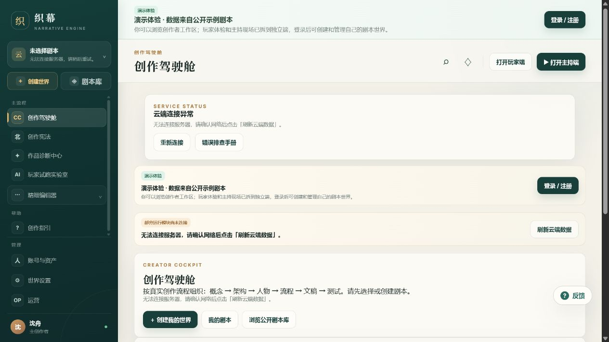

**问题**

- 页面同时出现顶部演示条、云端连接异常卡、第二条演示卡、部分模块未连接卡和内容区内错误文案。
- “登录 / 注册”“重新连接”“刷新云端数据”等动作重复，用户无法判断哪个最有效。
- 页面标题“创作驾驶舱”在顶栏和内容区重复。
- 错误状态占据首屏主要空间，真正的“创建我的世界”被压到下方。

**建议**

- 合并为一个全局状态条：“当前为演示模式，云端数据不可用；你仍可浏览界面。”
- 只保留一个主要恢复动作和一个次级排查入口。
- 内容区只显示与当前任务相关的空状态，不重复全局错误。
- 降级时保持“创建 / 导入 / 浏览示例”三选一清晰可见；不可执行的动作明确禁用并解释原因。

### Step 8 · Player 首次入口 — 良好

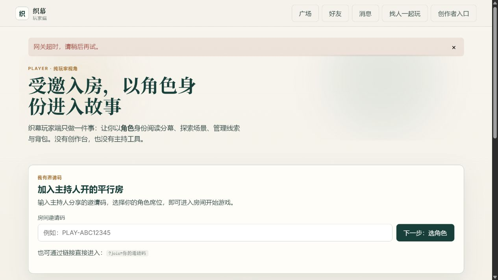

**优点**

- “受邀入房，以角色身份进入故事”直接说明玩家目标。
- 首屏只有一个主要任务：输入邀请码并选角色。
- 明确说明玩家端没有创作台和主持工具，角色边界清楚。
- 邀请码示例和 `?join=` 链接解释有助于恢复。

**风险**

- 网关错误条位于最上方，会让首次用户在理解产品前先接触失败信息。
- 错误条只说“稍后再试”，没有说明邀请码输入是否仍可继续、已输入内容是否会保留。
- “广场 / 好友 / 消息 / 找人一起玩”在未登录首屏可能分散受邀入房主任务。

**建议**

- 如果邀请码入口仍可填写，把非阻塞错误放到具体依赖模块附近。
- 邀请码校验失败时提供大小写、过期、房间状态和联系主持人的恢复路径。

### Step 9 · Host 首次入口 — 较差

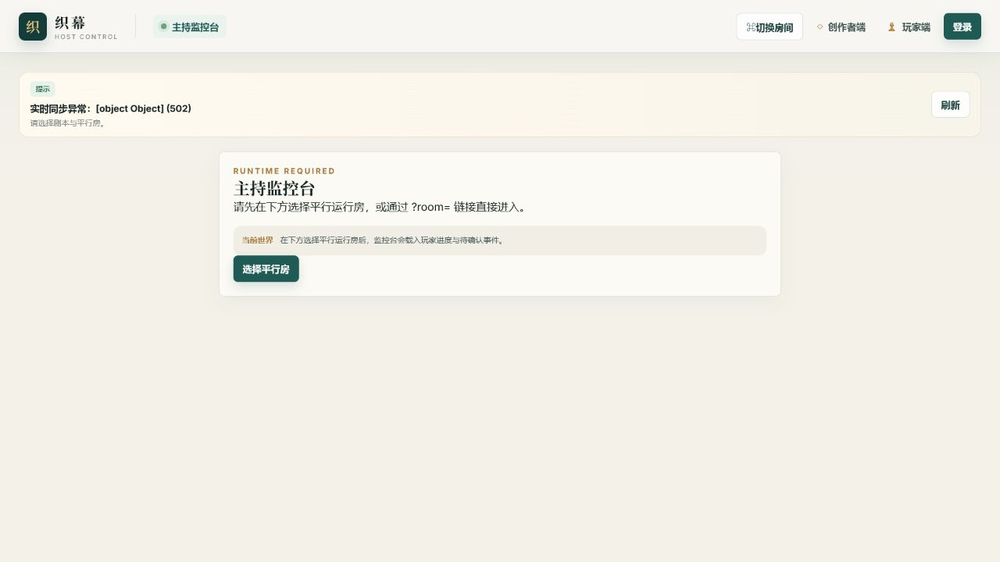

**问题**

- 错误直接显示 `实时同步异常：[object Object] (502)`，暴露实现对象且无法帮助用户恢复。
- 页面同时要求“选择剧本与平行房”与“选择平行房”，前置条件表达不一致。
- 大面积空白没有用来解释 Host 的价值、登录要求或最近房间。

**建议**

- 统一错误转换：`暂时无法连接云端，房间列表可能不是最新。` 并保留“重试”。
- 未登录先说明“登录后查看你有主持权限的运行房”，不要显示伪当前世界。
- 有历史时显示“最近主持”；无历史时显示“从创作者端创建测试房”。

### Step 10 · Host 选择运行房 — 一般

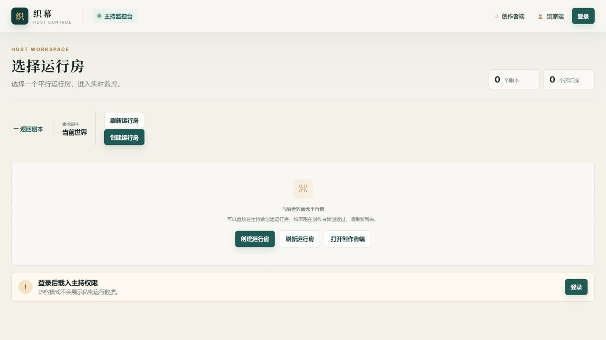

**优点**

- 页面任务单一，标题、统计、空状态和操作集中。
- 创建、刷新、打开创作者端三个恢复动作完整。
- 登录提示放在底部独立区，结构清楚。

**问题**

- 未登录且 0 个剧本时仍显示“当前剧本 / 当前世界”，会被理解为已经选中对象。
- 页面同时在顶部和空状态中重复“创建运行房 / 刷新运行房”。
- “创建运行房”在没有剧本、没有权限时是否可执行不明确。

**建议**

- 未登录时先完成登录；已登录但无剧本时引导去 Creator；有剧本但无房时再显示创建运行房。
- 每种前置状态只保留一组动作。

### Step 11 · 早期创意提案 — 需重做当前品牌版

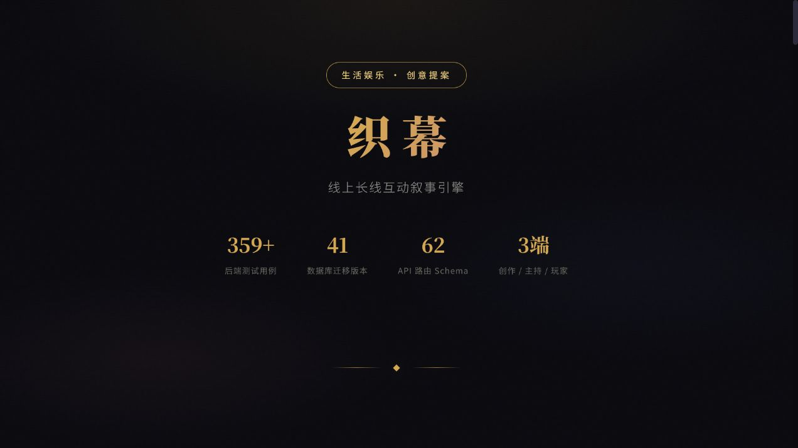

**问题**

- 黑金科技视觉与当前米白、墨绿、铜金的编辑部气质不是同一品牌。
- 首屏用测试数、迁移数和 Schema 数量证明价值，评委容易先看到工程规模而非用户改变。
- 数字已经与当前仓库基线不一致，长期硬编码会持续产生事实风险。
- “线上长线互动叙事引擎”偏抽象，弱于当前官网“把一个剧本运行成一场真正同步的故事”。

**建议**

- 保留历史版本，不原地篡改比赛快照。
- 新建当前品牌版：用户问题 → 从稿件到首场 → 三端运行证据 → 差异化 → 当前成熟度与下一步。
- 只使用同一提交可复核的数字；更优先使用真实截图、真实流程和真实案例。

## 3. 最高影响改动

| 优先级 | 改动 | 影响 |
|---|---|---|
| P0 | 修复 Host `[object Object]` 错误转换 | 信任、可恢复性、产品完成度 |
| P0 | 合并 Creator 演示 / 断线 / 登录重复提示 | 首次理解和核心任务可见性 |
| P0 | 停止创意提案长期硬编码工程数字 | 对外事实一致性 |
| P1 | 移动菜单加入登录与主 CTA | 移动端转化 |
| P1 | 未登录 / 无剧本 / 无房间按前置条件拆空状态 | Host 流程清晰度 |
| P1 | 做一条三端同屏事件演示 | 官网差异化证明 |
| P1 | 统一当前品牌视觉 | 品牌记忆和宣发协调 |

## 4. 证据限制

- 本轮没有使用真实账号、真实剧本和生产 API，因此不能判断登录后完整创作、主持和玩家流程是否顺畅。
- 截图只能支持视觉、信息层级和显性文案判断，不能证明完整 WCAG 合规。
- 键盘、读屏、焦点顺序、200% 缩放、颜色对比、动效减弱和真实网络恢复仍需专项测试。
- 本地 API 未连接使错误和空状态被充分暴露；这些状态值得修复，但不能据此断言生产服务当前不可用。
