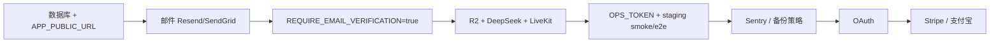

# 织幕 · 商业化外部服务对接手册

> **用途**：列出 AI 无法代你完成的外部注册/配置项；每项至少提供 **两条可替换路线**。  
> **代码侧**：对应 env 已在 `backend/.env.production.example` 留空；填好后重启 API 即可切换，无需改代码。  
> **最后更新**：2026-06-06（Beta-5：多邮件服务商 + 邮箱验证）

---

## 快速清单（你需要亲自做的）

| 优先级 | 服务 | 路线 A（推荐） | 路线 B（备选） | 必填 env |
|--------|------|----------------|----------------|----------|
| P0 | 数据库 | Supabase / Neon / RDS | Docker 自建 Postgres | `DATABASE_URL` |
| P0 | 公网访问 | Cloudflare + VPS/nginx | 单机 Docker staging | `APP_PUBLIC_URL` |
| P0 | 事务邮件 | **Resend**（已对接） | SendGrid / Mailgun | `EMAIL_PROVIDER` + 密钥 + `MAIL_FROM` |
| P1 | 对象存储 | **Cloudflare R2**（已对接） | AWS S3 / MinIO | `R2_*` 或 `AWS_*` |
| P1 | AI 创作 | **DeepSeek**（已对接） | OpenAI 兼容网关 | `DEEPSEEK_*` |
| P2 | 语音房 | **LiveKit Cloud**（已对接） | 自建 LiveKit | `LIVEKIT_*` |
| P2 | 监控告警 | Sentry | Grafana Cloud + OTEL | `SENTRY_DSN` / `OTEL_*` |
| P3 | OAuth 登录 | Google | GitHub | `GOOGLE_*` / `GITHUB_*`（预留） |
| P3 | 订阅支付 | Stripe | 支付宝当面付 | `STRIPE_*` / `ALIPAY_*`（预留） |

---

## 0. 部署与数据库

### 路线 A：托管 PostgreSQL（推荐生产）

**适合**：不想自己管备份、高可用、补丁。

| 平台 | 注册 | 拿到什么 | 填入 env |
|------|------|----------|----------|
| [Supabase](https://supabase.com) | 新建 Project → Settings → Database | Connection string (URI) | `DATABASE_URL=postgresql://...` |
| [Neon](https://neon.tech) | 新建 Project → Connection details | Pooler URI（带 `-pooler`） | 同上，`DATABASE_SSL=true` |
| AWS RDS | RDS 控制台创建 Postgres 16 | 主实例 endpoint | 同上 |

**你要做的**：

1. 创建数据库实例，记下 **连接串**（含用户名/密码/库名）。
2. 在 `backend/.env` 填写 `DATABASE_URL`；生产设 `DATABASE_SSL=true`。
3. 在 API 容器/服务器执行一次迁移：
   ```bash
   cd backend && npm run db:migrate
   ```
4. 确认迁移含 `020_email_verification.sql`（邮箱验证表）。

### 路线 B：Docker 自建 Postgres（推荐预发/内网）

**适合**：本地预发、离线演示、成本敏感。

1. 使用仓库根目录 `docker-compose.staging.yml`。
2. 复制 `.env.production.example` → `.env.staging`，填写 `POSTGRES_PASSWORD`。
3. 启动：`docker compose -f docker-compose.staging.yml up -d --build`。
4. 访问 `http://localhost:8080`（或 `STAGING_HTTP_PORT`）。

**切换**：生产可从 B 迁到 A——导出 `pg_dump`，导入托管库，改 `DATABASE_URL` 后重启。

---

## 1. 公网 URL 与 CORS

邮件里的重置/验证链接、前端 API 调用都依赖 **`APP_PUBLIC_URL`**。

| 路线 | 做法 | env |
|------|------|-----|
| A · 域名 + CDN | 域名 DNS → Cloudflare → 源站 nginx | `APP_PUBLIC_URL=https://app.你的域名` |
| B · 预发端口 | Docker staging 映射 8080 | `APP_PUBLIC_URL=http://你的IP:8080` |

前后端不同域时额外设置：

```env
CORS_ORIGIN=https://app.你的域名
```

---

## 2. 事务邮件（找回密码 + 邮箱验证）

后端已支持多服务商，通过 **`EMAIL_PROVIDER`** 切换：

| 值 | 说明 |
|----|------|
| `resend` | 默认；你已有 `jing597.xyz` 域名 |
| `sendgrid` | Twilio SendGrid |
| `mailgun` | Mailgun EU/US |
| `console` | 仅开发：stdout 打印，不发真信 |

### 路线 A：Resend（推荐，你已部分完成）

1. 登录 [resend.com](https://resend.com) → **Domains** → 确认 `jing597.xyz` 已验证。
2. **API Keys** → Create → 复制密钥。
3. 填写 env：
   ```env
   EMAIL_PROVIDER=resend
   RESEND_API_KEY=re_xxxxxxxx
   MAIL_FROM=织幕账号 <account@jing597.xyz>
   APP_PUBLIC_URL=https://app.jing597.xyz
   ```
4. 生产公开注册时：
   ```env
   REQUIRE_EMAIL_VERIFICATION=true
   ```
5. 测试发信（Resend 测试域只能发到账号内已验证邮箱）：
   - 开发可用 `onboarding@resend.dev` + 你的 Resend 账号邮箱做收件测试。

**API 端点（已实现，无需再写）**：

- `POST /api/auth/forgot-password` — 找回密码
- `POST /api/auth/reset-password` — 提交新密码
- `POST /api/auth/verify-email` — 邮箱验证（`?verify=` 链接）
- `POST /api/auth/resend-verification` — 重发验证（需登录）
- `GET /api/auth/config` — 前端读取是否强制验证

### 路线 B：SendGrid

1. [SendGrid](https://app.sendgrid.com) 注册 → Settings → **API Keys** → Create。
2. **Sender Authentication** → 验证域名或 Single Sender。
3. env：
   ```env
   EMAIL_PROVIDER=sendgrid
   SENDGRID_API_KEY=SG.xxxxxxxx
   MAIL_FROM=织幕 <noreply@你的域名>
   APP_PUBLIC_URL=https://app.你的域名
   REQUIRE_EMAIL_VERIFICATION=true
   ```

### 路线 C：Mailgun

1. [Mailgun](https://app.mailgun.com) → Sending → Domains → 添加域名并完成 DNS。
2. Settings → API Keys。
3. env：
   ```env
   EMAIL_PROVIDER=mailgun
   MAILGUN_API_KEY=xxxxxxxx
   MAILGUN_DOMAIN=mg.你的域名
   MAIL_FROM=织幕 <noreply@你的域名>
   APP_PUBLIC_URL=https://app.你的域名
   ```

**运维检查**：`GET /api/ops/status`（需 `OPS_API_TOKEN`）→ `features.email` 显示 provider 与 configured 状态。

---

## 3. 对象存储（线索图、音频）

| 路线 | 注册 | env |
|------|------|-----|
| A · Cloudflare R2 | Cloudflare Dashboard → R2 → Create bucket → Manage R2 API Tokens | `OBJECT_STORAGE_PROVIDER=r2` + `R2_*` |
| B · AWS S3 | IAM 用户 + S3 bucket + CORS | `OBJECT_STORAGE_PROVIDER=s3` + `AWS_*`（代码路径与 R2 同 S3 协议，按 `.env.production.example` 预留） |

**你要做的（R2）**：

1. 创建 Bucket，开启公共访问或使用 signed URL（当前实现为 signed URL）。
2. 创建 API Token（Object Read & Write）。
3. 填写 `R2_ACCOUNT_ID`、`R2_ACCESS_KEY_ID`、`R2_SECRET_ACCESS_KEY`、`R2_BUCKET`、`R2_PUBLIC_ENDPOINT`。

---

## 4. AI 悬疑创作（DeepSeek）

| 路线 | 注册 | env |
|------|------|-----|
| A · DeepSeek 官方 | [platform.deepseek.com](https://platform.deepseek.com) API Key | `DEEPSEEK_API_KEY` |
| B · OpenAI 兼容代理 | 任意兼容 `/v1/chat/completions` 的网关 | `OPENAI_API_KEY` + `OPENAI_BASE_URL`（Phase 后续接线，env 已预留） |

当前代码走 DeepSeek 专用路由；换网关需后续小改 `story-assistant` 模块或配置统一 LLM 客户端。

---

## 5. 语音连麦（LiveKit）

| 路线 | 注册 | env |
|------|------|-----|
| A · LiveKit Cloud | [cloud.livekit.io](https://cloud.livekit.io) 项目 | `LIVEKIT_URL`、`LIVEKIT_API_KEY`、`LIVEKIT_API_SECRET` |
| B · 自建 | Docker 部署 [livekit/livekit-server](https://github.com/livekit/livekit) | 同上，URL 指向自建 wss |

未配置时语音相关 API 返回明确错误，不影响文字剧本功能。

---

## 6. 运维与安全（降低运维难度）

### 路线 A：Sentry（错误追踪，推荐）

1. [sentry.io](https://sentry.io) 创建 Node 项目。
2. 复制 DSN（代码侧 Phase 3 接线；env 已预留 `SENTRY_DSN=`）。

### 路线 B：OpenTelemetry + Grafana Cloud

1. [grafana.com](https://grafana.com) → Cloud → OTLP endpoint。
2. env：
   ```env
   OTEL_ENABLED=true
   OTEL_EXPORTER_OTLP_ENDPOINT=https://otlp-gateway-xxx.grafana.net/otlp
   ```

### 必配（生产）

```env
OPS_API_TOKEN=随机长字符串   # 保护 /api/ops/*
ALLOW_DEMO_USER_HEADER=false
OPENAPI_UI=false
LOG_FORMAT=json
```

**健康检查**：

- 存活：`GET /api/health/live`
- 就绪：`GET /api/health/ready`
- 运维快照：`GET /api/ops/status` + Header `x-ops-token: <OPS_API_TOKEN>`

**预发验收**（仓库已提供）：

```bash
npm run staging:sync-env
docker compose -f docker-compose.staging.yml up -d --build
npm run staging:smoke    # 8 项
npm run staging:e2e      # 12 项
cd backend && npm test   # 后端单测
```

---

## 7. OAuth 社交登录（Phase 2 · env 已预留）

| 路线 | 控制台 | 回调 URL 示例 | env |
|------|--------|---------------|-----|
| A · Google | [Google Cloud Console](https://console.cloud.google.com) → OAuth 2.0 | `https://app.你的域名/api/auth/oauth/google/callback` | `GOOGLE_CLIENT_ID`、`GOOGLE_CLIENT_SECRET` |
| B · GitHub | GitHub → Settings → Developer settings → OAuth Apps | 同上路径 `/github/callback` | `GITHUB_CLIENT_ID`、`GITHUB_CLIENT_SECRET` |

**状态**：路由与前端按钮 **尚未实现**；你完成注册后把 Client ID/Secret 填入 env，下一阶段开发可直接对接。

---

## 8. 订阅与支付（Phase 4 · env 已预留）

| 路线 | 适用 | env |
|------|------|-----|
| A · Stripe | 国际卡、订阅 | `STRIPE_SECRET_KEY`、`STRIPE_WEBHOOK_SECRET` |
| B · 支付宝 | 国内用户 | `ALIPAY_APP_ID`、`ALIPAY_PRIVATE_KEY` |

**状态**：计费表与 webhook **尚未实现**；商业化上线前需单独里程碑。

---

## 9. 推荐上线顺序



1. **本周可完成**：Resend 生产发信 + `REQUIRE_EMAIL_VERIFICATION=true` + staging 全绿。
2. **下一迭代**：Sentry、数据库自动备份（Supabase/Neon 自带；自建需 `pg_dump` cron）。
3. **再后**：OAuth、协作者邮件邀请、订阅。

---

## 10. 你需要发给我的信息（填完 env 后）

为继续对接 **OAuth / Stripe / Sentry**，请在本机填好 `backend/.env.production.example` 对应项后告知：

- [ ] `APP_PUBLIC_URL` 最终域名（不含密钥）
- [ ] 邮件：`EMAIL_PROVIDER` 选型 + 域名是否已通过 SPF/DKIM
- [ ] 数据库：托管 or Docker（不含连接串密码）
- [ ] 是否启用 `REQUIRE_EMAIL_VERIFICATION=true`
- [ ] OAuth 选型（Google / GitHub）及回调域名是否可配置
- [ ] 支付选型（Stripe / 支付宝 / 暂不上线）

**请勿在聊天中粘贴完整 API Key**；只需说明「已填入 backend/.env」即可。

---

## 附录：测试邮件而不发真信

```env
EMAIL_PROVIDER=console
EMAIL_DELIVERY_STUB=1
APP_PUBLIC_URL=http://localhost:4173
```

后端测试会捕获 `peekTestResetUrl()` / `peekTestVerifyUrl()` 中的链接；生产 **禁止** 开启 `EMAIL_DELIVERY_STUB`。
