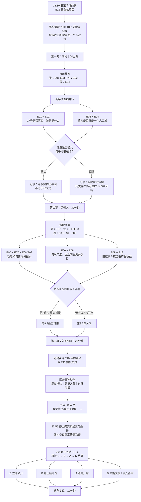
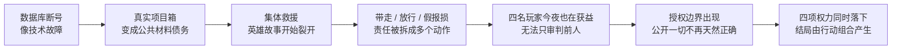

# 《未归还》全剧情流程图谱

这张总图只描述玩家实际经历的顺序。事实是否成立，仍以独立线索核验门槛为准。

```mermaid
flowchart TD
    S["22:30 旧馆闭馆前夜<br/>E12 已在核验区"] --> T["系统提示 2001-017 无验收记录<br/>预告片仍称沈启明一个人救馆"]

    T --> A1["第一幕：断号｜20分钟"]
    A1 --> A1C["可用线索<br/>梁：E01 E03｜沈：E02｜周：E04"]
    A1C --> Q1["两条调查线并行"]
    Q1 --> Q1A["E01 + E02<br/>17号是否真实、装的是什么"]
    Q1 --> Q1B["E03 + E04<br/>抢救是否真是一个人完成"]
    Q1A --> HX{"何溪是否确认<br/>箱子今夜在场？"}
    Q1B --> HX
    HX -->|"确认"| FOUND["记录：今夜实物已寻回<br/>不等于已交付"]
    HX -->|"拒绝"| PENDING["记录：实物状态待核<br/>历史存在仍可由E01+E02证明"]

    FOUND --> A2["第二幕：保管人｜30分钟"]
    PENDING --> A2
    A2 --> A2C["新增线索<br/>梁：E07｜沈：E05 E08<br/>周：E09｜何：E06"]
    A2C --> Q2A["E05 + E07 + E08/E09<br/>暂缓如何变成假报损"]
    A2C --> Q2B["E06 + E09<br/>何岚带走、沈启明看见并放行"]
    A2C --> Q2C["E09 + E12<br/>旧叙事今夜仍在产生收益"]
    Q2A --> G{"23:20 沈闻川答复基金"}
    Q2B --> G
    Q2C --> G
    G -->|"待核验 / 重大错误"| GON["第9.3条仍可用"]
    G -->|"无争议 / 未答复"| GOFF["第9.3条关闭"]

    GON --> A3["第三幕：如何归还｜25分钟"]
    GOFF --> A3
    A3 --> A3C["何溪获得 E10 实物查验<br/>与 E11 授权核对"]
    A3C --> Q3["区分三种动作<br/>提交核验｜登记入藏｜对外传播"]
    Q3 --> COST["23:45 每人说<br/>我愿意付出的代价是……"]
    COST --> LOCK["23:55 停止提交新线索与条件<br/>四人各自锁定终局动作"]
    LOCK --> RESOLVE["00:00 先核验F1-F6<br/>再按 C → B → A → D 结算"]
    RESOLVE --> C["C 立即公开"]
    RESOLVE --> B["B 更正后开馆"]
    RESOLVE --> A["A 照常开馆"]
    RESOLVE --> D["D 未能交接 / 转入待审"]
    C --> R["退角复盘｜10分钟"]
    B --> R
    A --> R
    D --> R
```

## 玩家体验曲线

```mermaid
flowchart LR
    X1["数据库断号<br/>像技术故障"] --> X2["真实项目箱<br/>变成公共材料债务"]
    X2 --> X3["集体救援<br/>英雄故事开始裂开"]
    X3 --> X4["带走 / 放行 / 假报损<br/>责任被拆成多个动作"]
    X4 --> X5["四名玩家今夜也在获益<br/>无法只审判前人"]
    X5 --> X6["授权边界出现<br/>公开一切不再天然正确"]
    X6 --> X7["四项权力同时落下<br/>结局由行动组合产生"]
```
