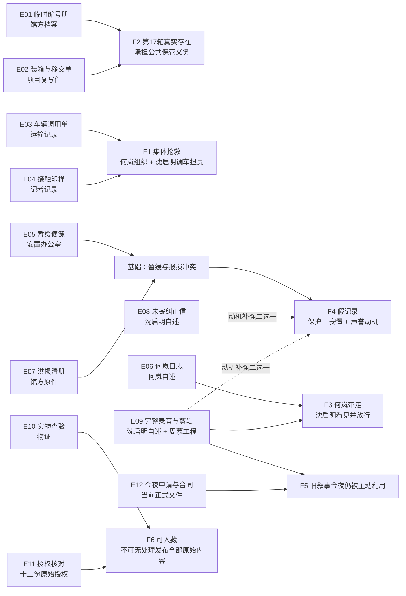

# 《未归还》事实与线索图谱

## 六项事实的最低闭环

## 线索出现顺序与持有人

| 幕 | 线索 | 初始持有人 | 核心用途 | 单独不能证明 |
|---|---|---|---|---|
| 1 | E01 临时编号册 | 梁芷 | 真实编号 | 箱内内容、去向 |
| 1 | E02 装箱与移交单 | 沈闻川 | 内容与公共保管义务 | 是否幸存、谁带走 |
| 1 | E03 车辆调用单 | 梁芷 | 沈启明真实贡献 | 何岚组织角色 |
| 1 | E04 接触印样 | 周慕 | 何岚与居民的行动 | 第17箱去向 |
| 1 | E12 今夜签约 | 公共 | 今夜收益与补救程序 | 2001年事实 |
| 2 | E05 暂缓便笺 | 沈闻川 | 没有人要求报损 | 谁填写、为何填写 |
| 2 | E06 何岚日志 | 何溪 | 何岚带走与长期保管 | 沈启明是否看见 |
| 2 | E07 洪损清册 | 梁芷 | 沈启明填写报损 | 记录为何不实 |
| 2 | E08 未寄信 | 沈闻川 | 沈启明反省与复合动机 | 箱子现状、授权 |
| 2 | E09 录音与剪辑 | 周慕 | 放行、假记录、当前删节 | 保管质量、授权 |
| 3 | E10 实物查验 | 何溪 | 箱子现存并可入藏 | 逐份传播权限 |
| 3 | E11 授权核对 | 何溪 | 入藏与传播边界 | 过去行动真相 |

## 为什么没有万能线索

- E08 和 E09 都来自沈启明的自述体系，不能替代物证、记者记录或何岚日志。
- E09 的录音与剪辑日志虽有两部分，但来自同一持有人和工程链，只算一个来源组。
- E10 证明箱子现存，不证明沈启明当年看到；E11 证明权限，不证明历史。
- F4 需要记录冲突 E05+E07，再加 E08/E09 的动机补强，任何一张都不能独立完成。
