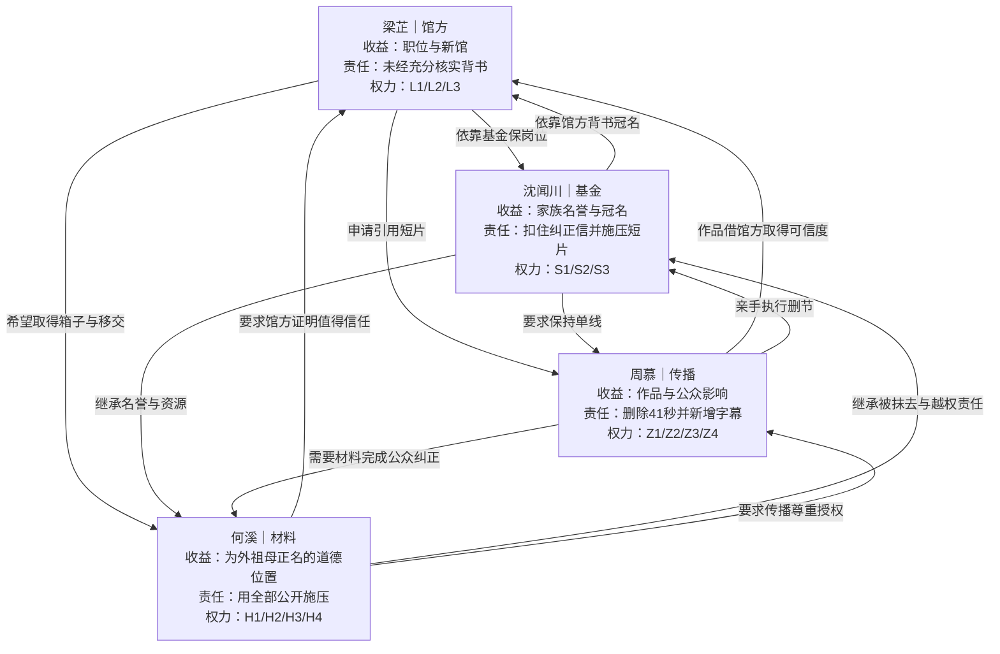
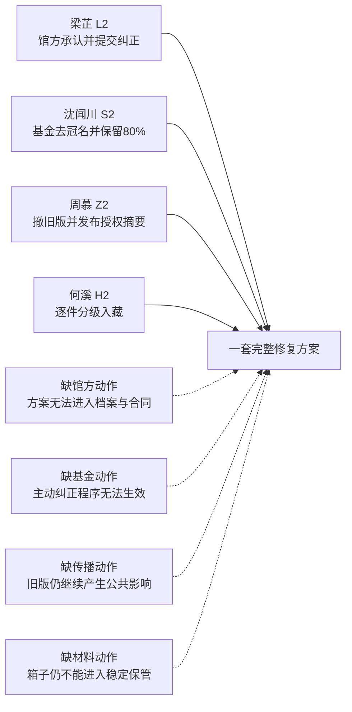

# 《未归还》角色关系与权力图谱

## 四项权力为什么不可互换

## 人物弧线

| 角色 | 开场自我叙事 | 必须面对 | 可能完成的转变 |
|---|---|---|---|
| 梁芷 | 我只是保住公共服务 | 自己主动把沿用说法写成“已核实” | 从结果正当化转为承担程序责任 |
| 沈闻川 | 我是在保护一个好人 | 爱与继续替他沉默不是一回事 | 让真实贡献脱离错误冠名仍然存在 |
| 周慕 | 我是让故事被看见的人 | 自己也通过剪辑制造不可见 | 从抢夺叙事转为承认传播边界 |
| 何溪 | 我代表被抹去的人讨回公道 | 保护者也可能控制他人声音 | 从替别人决定转为建立可监督归还 |
