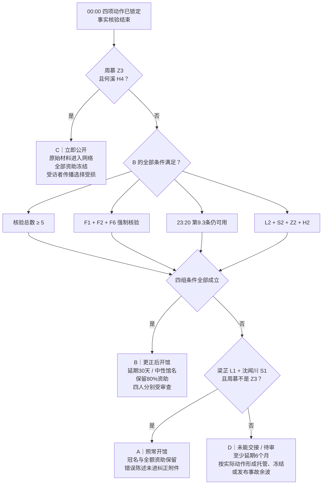
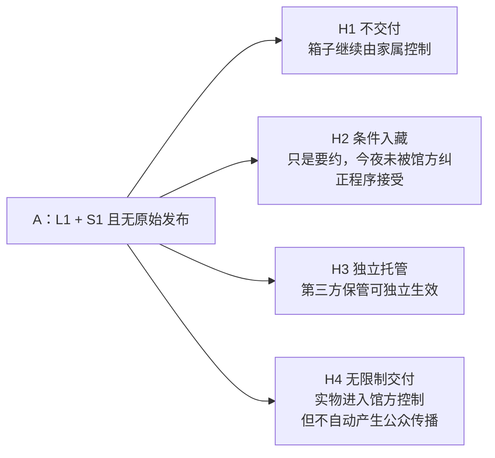

# 《未归还》结局分流图谱

## A 结局的材料余波

## D 结局的典型路径

- 四人都想修复，但事实不足或动作不配套。
- 沈闻川在 23:20 关闭第 9.3 条，之后再选 S2 也无法执行。
- 周慕选 Z3，但何溪不选 H4：发布尝试造成事故，却拿不到完整箱内原始材料。
- 梁芷 L3、何溪 H3：形成稳定的正式待审与第三方托管。
- 沈闻川 S3：本轮资金和冠名宣传同时冻结。

## 四个结果不是道德评分

| 结局 | 主要获得 | 主要失去 | 核心含义 |
|---|---|---|---|
| A 照常开馆 | 即时公共服务、全额资金 | 正式纠正与材料稳定归还 | 知情后继续使用旧叙事 |
| B 更正后开馆 | 可执行修复、分级入藏、80%资金 | 时间、职位、家族与职业信誉 | 四项责任终于组成方案 |
| C 立即公开 | 事实快速进入公众视野 | 授权边界、全部资助、传播可逆性 | 看见事实不等于尊重当事人 |
| D 待审 | 保留下一次核验与托管可能 | 至少六个月时间与项目连续性 | 正确意愿未必组成可执行行动 |
