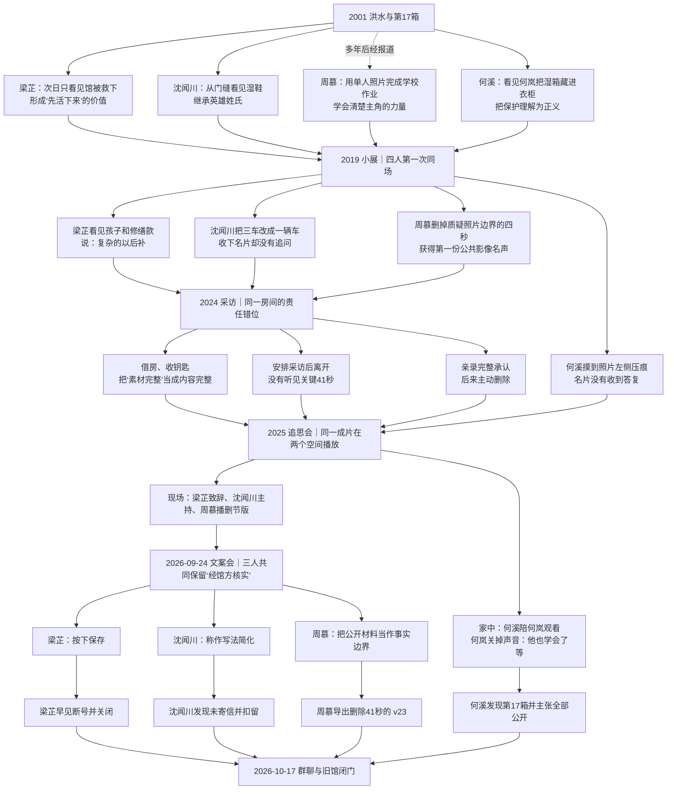
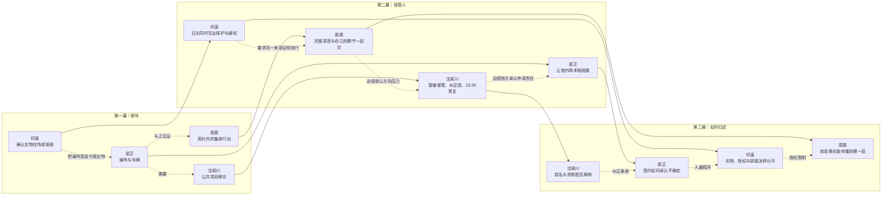
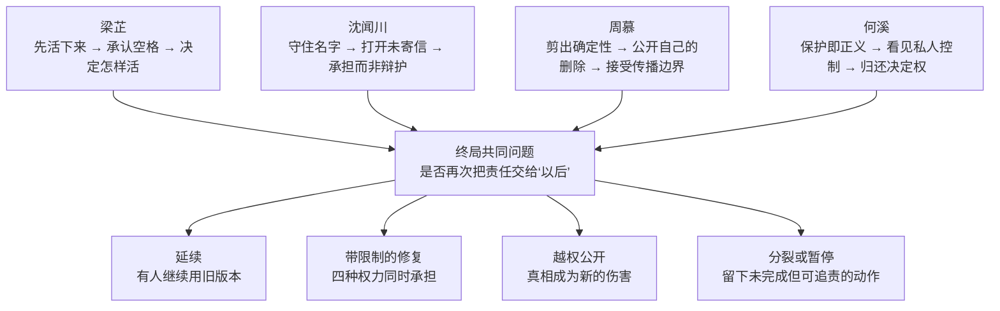

# 《未归还》四线交叉剧情图谱

> 作者、主持和审核者使用。玩家不应在开场前看见完整图。机械证据链与结局判定仍以 `maps/` 为准，本图只回答“每个人怎样走到今晚”。

## 一、共同事件怎样把四人缝在一起

## 二、三幕里谁推动什么

## 三、四条人物弧最终在哪里交叉

四人最终不是对同一道道德题给答案，而是分别控制四种不能互相替代的权力：馆方签署、资金与冠名、公众传播、实物与访问。巧合把他们带到同一张桌上，分权决定他们不能靠一个英雄完成结局。
